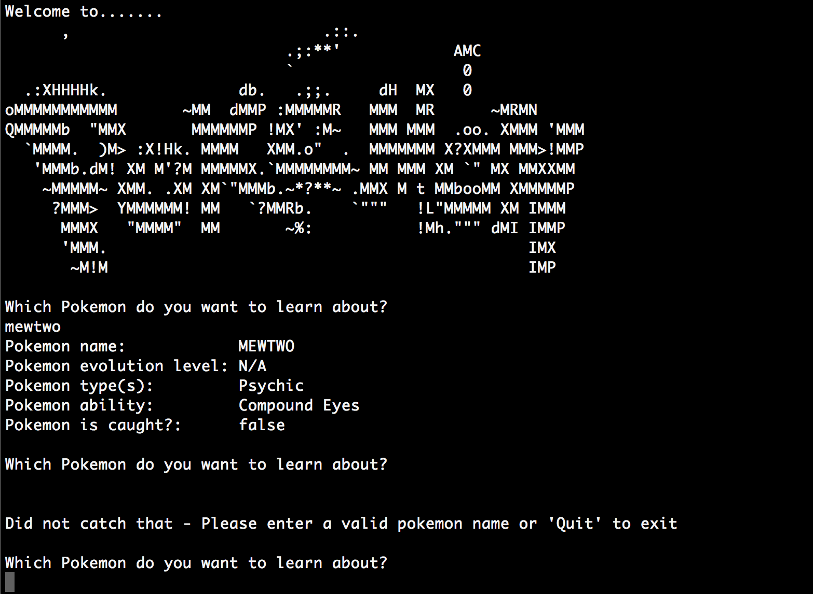

# PokeDex

_PokeDex_ was a small terminal application created for the last day of Phase 1 at DevBootcamp. The application was intended to mimic the PokeDex from Pokemon. 



#### Created On
```
June 5, 2015
```

## How it Works
```
* User loads the application and is asked which Pokemon they would like to learn about. 
* User types in the name of a Pokemon and the information is laid out for them. 
* If Pokemon does not exist or the user leaves the space blank, it asks the user again for a different entry. 
* If the user wants to exit out of the program, the user can type 'exit' or 'quit'. 
```

# Technologies
```
* Active Record
```

## Notes
```
* The PokeDex only contains the first generation (150) of Pokemon. 
```
